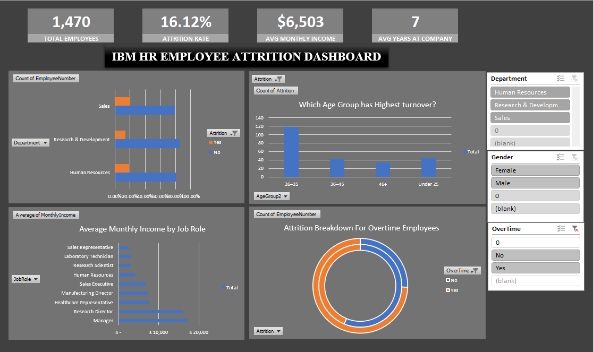

# IBM-HR-Employee-Attrition-Dashboard-Excel-# IBM HR Employee Attrition Dashboard (Excel)

An interactive HR analytics dashboard built in Microsoft Excel, analyzing 1,470 employee records to uncover the key drivers behind employee attrition. Built using Pivot Tables, advanced formulas, and connected slicers to create a fully interactive, single-click filtering experience across four linked visualizations.

## Dashboard Preview

## Project Summary

This project analyzes the IBM HR Employee Attrition dataset to answer a core business question: why are employees leaving, and which factors predict it? The dashboard combines KPI summary cards, four interconnected charts, and three live slicers (Department, Gender, OverTime) so a user can filter the entire dashboard with a single click and instantly see how attrition patterns shift across different employee segments.

## Key Insights

- Overall attrition rate sits at **16.12%**, with 1,470 total employees and an average tenure of 7 years across the company.
- The **26–35 age group shows dramatically higher turnover** than every other age band combined, making early-career retention the single biggest attrition lever for this organization.
- **Sales and Research & Development** both show visible attrition concentration, while Human Resources carries a comparatively smaller share of departures.
- Employees working **overtime show a clearly disproportionate share of attrition** in the donut breakdown, reinforcing overtime as a meaningful risk signal rather than a minor factor.
- **Average monthly income sits at $6,503**, with Sales Representatives and Laboratory Technicians anchoring the lower end of the Average Monthly Income by Job Role chart — a useful lens for compensation-driven retention strategy.

## Tools and Skills Used

- Microsoft Excel — Pivot Tables, Pivot Charts
- Advanced formulas: COUNTIF, COUNTIFS, AVERAGEIF, AVERAGEIFS, INDEX, MATCH, IFS, IFERROR
- Conditional Formatting for risk flagging
- Slicers with Report Connections for cross-chart interactivity
- Data cleaning and feature engineering (custom AgeGroup and SalaryBand columns)
- Dashboard design and KPI card layout

## Certification

This project was built after completing the **MS Excel for Data Analytics** course on **SkillUp by Simplilearn**, a free, self-paced program covering data cleaning, advanced formulas, Pivot Tables, and chart building. The course gave me the formula fluency and Pivot Table foundation needed to design and debug this dashboard from raw data to a fully interactive end product, and I'd recommend it to anyone starting their Data Analyst journey on a zero-cost budget.

## Dataset Source

IBM HR Analytics Employee Attrition & Performance dataset, sourced from Kaggle. 1,470 rows, 35 columns, covering demographic, compensation, satisfaction, and tenure data for a fictional IBM workforce.

## Author

Pranav — Aspiring Data Analyst | BBACA Graduate
